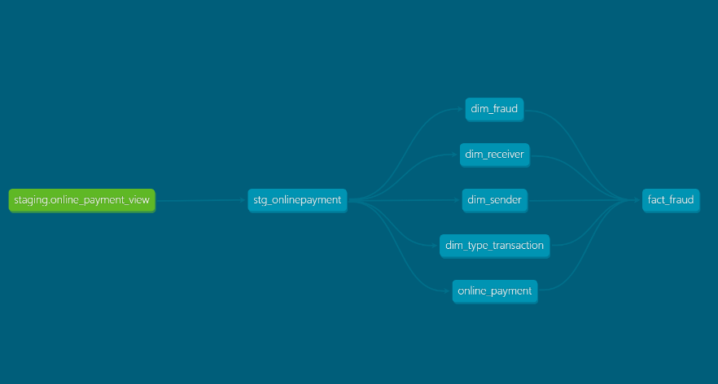

Here's the lineage look like

  
We're using Star Schema on our data modelling.
- Dimensional Table:
  - dim_fraud
  - dim_receiver
  - dim_sender
  - dim_type_transactio
  - online_payment
- Fact Table:
  - fact_fraud
    - Partitioning:
        - Data is partitioned by day using the timestamp column.